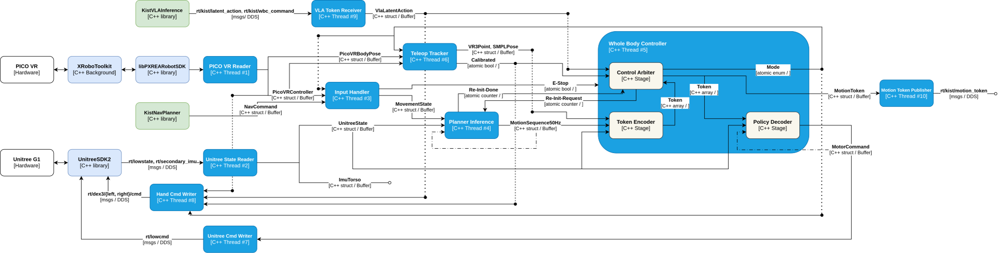

# kist-gearsonic-inference

C++ inference pipeline for GR00T WholeBodyControl on the Unitree G1 humanoid robot.

## Architecture

[](docs/kist-gearsonic-inference.svg)

## Dependencies

| Component | Version | Role |
|---|---|---|
| `XRoboToolkit` | 1.0.0 | PICO VR PC daemon (host-side) |
| `libPXREARobotSDK` | `85bac4d` | PICO VR C++ client library |
| `unitree_sdk2` | `21d0a3b` | Unitree G1 + Dex3-1 hand DDS client library |
| CycloneDDS + CycloneDDS-CXX | 0.10.2 | `idlc`/`idlcxx` codegen for the VLA DDS types |
| CUDA | 12.6 | GPU runtime for TensorRT inference |
| TensorRT | 10.7 | ONNX → TRT engine conversion and inference |
| `yaml-cpp` | distro | config parsing |
| GEAR-SONIC models | HF `nvidia/GEAR-SONIC` | planner / encoder / decoder ONNX |

## Installation

#### 1. Clone Repository

```bash
git clone https://github.com/Safety-Node/kist-gearsonic-inference.git
cd kist-gearsonic-inference
```

All following steps run from the repository root.

#### 2. Install XRoboToolkit (host-side)

The VR daemon talks to the headset over USB and runs on the host; the
container reaches it via `--network host`.

```bash
wget https://github.com/XR-Robotics/XRoboToolkit-PC-Service/releases/download/v1.0.0/XRoboToolkit_PC_Service_1.0.0_ubuntu_22.04_amd64.deb
sudo dpkg -i XRoboToolkit_PC_Service_1.0.0_ubuntu_22.04_amd64.deb
```

#### Quick Start with Docker

The image bakes in everything below (SDKs, toolchain, models, and the build):

```bash
./docker/build.sh      # builds the image (docker build -t kist-gearsonic-inference)
./docker/run.sh        # shell in the container; prebuilt binaries under build/
```

`run.sh` wires `--gpus all` (TensorRT), `--network host` (unitree/VLA DDS +
the VR daemon), and `--cap-add=SYS_NICE` (RT thread priorities). The numbered
steps below (3–8) are the manual (non-Docker) alternative — steps 1–2
above are required either way.

#### 3. Install libPXREARobotSDK

```bash
git clone https://github.com/XR-Robotics/XRoboToolkit-PC-Service.git thirdparty/XRoboToolkit-PC-Service
git -C thirdparty/XRoboToolkit-PC-Service checkout 85bac4dbc1fd5cef42c74a160d9c30aa3491f122

bash thirdparty/XRoboToolkit-PC-Service/RoboticsService/PXREARobotSDK/build.sh

mkdir -p thirdparty/pxrea/lib thirdparty/pxrea/include
cp thirdparty/XRoboToolkit-PC-Service/RoboticsService/PXREARobotSDK/PXREARobotSDK.h thirdparty/pxrea/include/
cp -r thirdparty/XRoboToolkit-PC-Service/RoboticsService/PXREARobotSDK/nlohmann thirdparty/pxrea/include/nlohmann/
cp thirdparty/XRoboToolkit-PC-Service/RoboticsService/PXREARobotSDK/build/libPXREARobotSDK.so thirdparty/pxrea/lib/
```

#### 4. Install unitree_sdk2

```bash
git clone https://github.com/unitreerobotics/unitree_sdk2.git thirdparty/unitree_sdk2
git -C thirdparty/unitree_sdk2 checkout 21d0a3b2c46ee48c8fdf2783becb6be3beb0a59b
```

#### 5. Install apt packages

```bash
sudo apt update && sudo apt install -y \
    build-essential cmake git pkg-config \
    libyaml-cpp-dev libssl-dev
```

#### 6. Install CycloneDDS (idlc toolchain)

CycloneDDS + CycloneDDS-CXX 0.10.2 into `/opt/cyclonedds`, pinned to match the
SDK's bundled `libddscxx` (required — the VLA DDS types are generated from
`idl/kist_latent_action.idl` at build time):

```bash
git clone --depth 1 -b 0.10.2 https://github.com/eclipse-cyclonedds/cyclonedds.git /tmp/cyclonedds
cmake -S /tmp/cyclonedds -B /tmp/cyclonedds/build \
    -DCMAKE_INSTALL_PREFIX=/opt/cyclonedds -DBUILD_IDLC=ON -DCMAKE_BUILD_TYPE=Release
sudo cmake --build /tmp/cyclonedds/build --target install -j"$(nproc)"

git clone --depth 1 -b 0.10.2 https://github.com/eclipse-cyclonedds/cyclonedds-cxx.git /tmp/cyclonedds-cxx
cmake -S /tmp/cyclonedds-cxx -B /tmp/cyclonedds-cxx/build \
    -DCMAKE_INSTALL_PREFIX=/opt/cyclonedds -DCMAKE_PREFIX_PATH=/opt/cyclonedds -DCMAKE_BUILD_TYPE=Release
sudo cmake --build /tmp/cyclonedds-cxx/build --target install -j"$(nproc)"

export PATH=/opt/cyclonedds/bin:$PATH      # idlc on PATH for Build
```

#### 7. Install CUDA and TensorRT

CUDA 12.6 and TensorRT 10.7, per the NVIDIA guides:

- https://developer.nvidia.com/cuda-12-6-0-download-archive
- https://developer.nvidia.com/tensorrt/download/10x

#### 8. Download Models

```bash
wget -P models https://huggingface.co/nvidia/GEAR-SONIC/resolve/main/model_encoder.onnx
wget -P models https://huggingface.co/nvidia/GEAR-SONIC/resolve/main/model_decoder.onnx
wget -P models https://huggingface.co/nvidia/GEAR-SONIC/resolve/main/planner_sonic.onnx
```

ONNX models are converted to TensorRT engines automatically on first run.

## Build

With Docker, run this inside the container (`./docker/run.sh`).

```bash
cmake -B build && cmake --build build
```

## Run

### 1. XRoboToolkit (PICO VR daemon)

With Docker, run this on the host, outside the container.

```bash
source env.sh
run_vr_daemon
```

Connect the headset from its XRoboToolkit app.

### 2. Control

```bash
./build/gearsonic_inference
```

### Controller

| Input | Action |
|---|---|
| Left stick | Move (magnitude = speed) |
| Right stick | Rotate facing |
| A | Return to IDLE |
| Y | Mode up (IDLE / Slow Walk / Walk) |
| Trigger + Y | Mode up (hard actions, e.g. Run) |
| X | Mode down |
| Trigger + B / A | Height up / down (crouch modes) |
| B held 1s | Teleop on / off (engage in the reference pose: forearms 90° forward, palms inward) |
| Left / right grip (analog) | Left / right Dex3-1 thumb close (0 = open, 1 = pressed against fingers) |
| Left / right trigger (analog) | Left / right Dex3-1 index+middle close (0 = open, 1 = cage / fist) |
| A + B + X + Y held 1s | Emergency stop |

## Usage

Embedding as a C++ library:

```cmake
add_subdirectory(kist-gearsonic-inference)
target_link_libraries(your_app PRIVATE gearsonic_inference)
```

```cpp
#include "system/gearsonic_inference.hpp"
#include "motion/input_handler.hpp"

auto& gearsonic_inf = kist::GearsonicInference::instance();
gearsonic_inf.install_signal_handlers();          // or call gearsonic_inf.request_quit() from your own handler

if (!gearsonic_inf.start("config/config.yaml"))   // THE ROBOT MOVES: 3s ramp, then policy control
    return 1;

// external navigation (optional): body-frame velocity, ~20Hz.
// zeros = stop, going silent = fallback to manual. Joystick always wins.
kist::InputHandler::instance().nav_buf.SetData({vx, vy, vyaw});

// ... your application runs here (keep the process alive) ...

gearsonic_inf.stop();                             // publishes damping — call on every exit path
```

## VLA mode (external latent tokens over DDS)

[kist-vla-inference](https://github.com/Safety-Node/kist-vla-inference) can
drive the whole body directly: it publishes 64-dim SONIC motion tokens +
Dex3 hand targets as `kist_msgs::LatentActionStep` on `rt/kist/latent_action`
(50 Hz), replacing the planner+encoder path.

- **Contract**: `idl/kist_latent_action.idl` — shared with kist-vla-inference;
  built into C++ types at build time by CycloneDDS `idlc` (0.10.2, matching
  the SDK's bundled ddscxx — a required dependency, see Install CycloneDDS;
  the Docker image includes it).
- **Behavior**: first-come ownership (`include/control/robot_ownership.hpp`)
  arbitrates VLA vs teleop — whichever claims the robot first keeps it.
  A token fresher than 200 ms claims for VLA and switches
  `WholeBodyController` into external-token mode (planner path bypassed);
  if teleop calibrated first, VLA tokens are ignored until restart.
  VLA ownership is sticky — a stream stale for 500 ms counts as LOST and
  the controller blends (1 s) to a verified safe standing token and keeps
  balancing there, hands holding their last targets; neither a resumed
  stream nor the planner path (its playback timeline froze at the pre-VLA
  state) may retake the robot — restart to recover. The e-stop outranks
  everything, always.
- **Interop probe**: `./build/vla_receiver_probe [domain_id] [iface]`
  prints receive rate and newest token — pair it with kist-vla-inference
  in `--io.action-transport dds` mode to verify the link without the robot.
